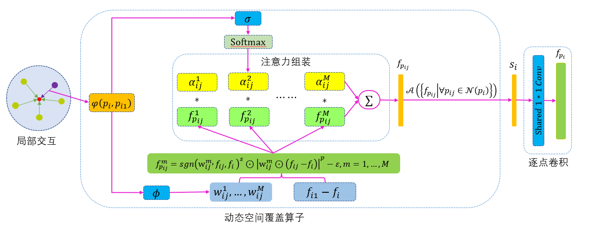

# 3D Point Cloud Classification Method Based on Dynamic Coverage of Local Area
基于局部区域动态覆盖的3D点云分类方法


by [Changshuo Wang*](https://www.changshuowang.site/about/), [Han Wang](), [Xin Ning](), [Weisheng Tian](), and [Weijun Li]().

## Introduction
This code is the reproduction of the pytorch 1.7+ version of **3D Point Cloud Classification Method Based on Dynamic Coverage of Local Area** on the ScanObjectNN.<br>


## Install


### 1. clone this repo
```
git clone https://github.com/changshuowang/DC-CNN_ScanObjectNN.git
cd DC-CNN_ScanObjectNN
```

### 2. create a conda virtual environment and activate it
```
conda create -n DC-CNN python=3.7 -y
conda activate DC-CNN
```

### 3. install required libs, pytorch 1.8.1, torchvision 0.9.1, etc.


## Useage

### Classification ScanObjectNN
**Train**:
The dataset will be automatically downloaded, run following command to train.

```
By default, it will create a fold named "log/{modelName}-{msg}-{randomseed}", which includes args.txt, best_checkpoint.pth, last_checkpoint.pth, log.txt, out.txt.
```

```
python main.py
```

**Test**:
To conduct voting testing, run

```
python voting.py --msg demo
```

## Contact

You are welcome to send pull requests or share some ideas with us. 

contact email: [wangchangshuo@semi.ac.cn](wangchangshuo@semi.ac.cn).


## Acknowledgment

Our implementation is mainly based on the following codebases. We gratefully thank the authors for their wonderful works.

[pointMLP](https://github.com/changshuowang/pointMLP-pytorch),
[EllipsoidQuery](https://github.com/VimsLab/EllipsoidQuery),
[RS-CNN](https://github.com/Yochengliu/Relation-Shape-CNN/),
[Pointnet2_PyTorch](https://github.com/erikwijmans/Pointnet2_PyTorch)


## LICENSE
DC-CNN is under the Apache-2.0 license. 
Please contact the authors for commercial use.


